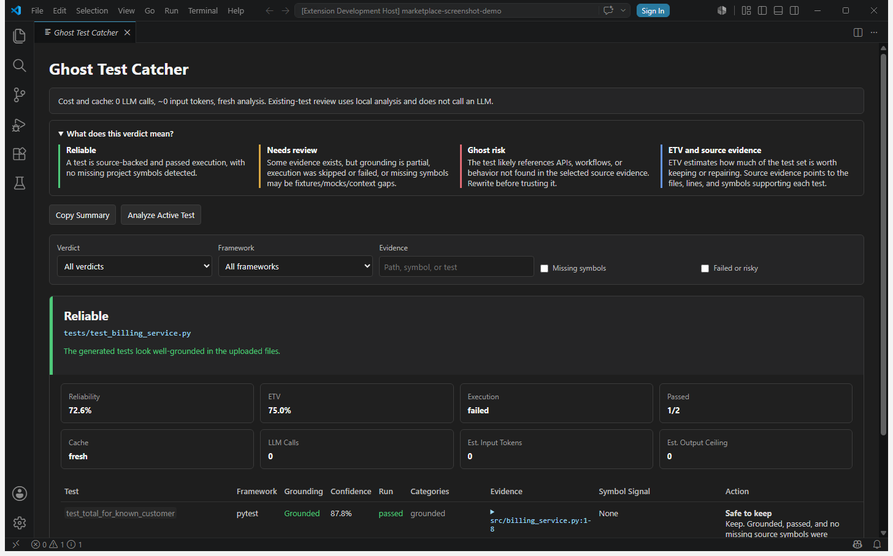
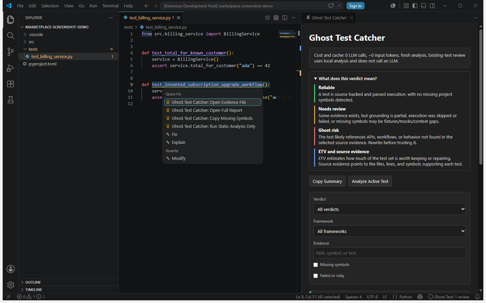
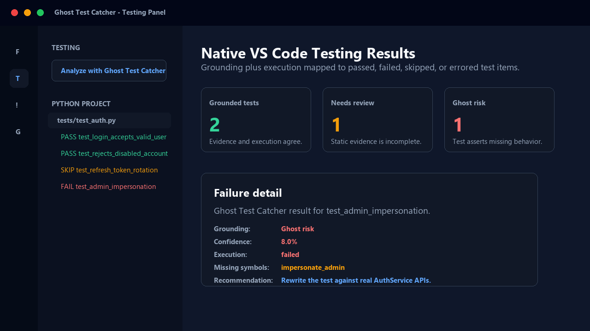

# Ghost Test Catcher for VS Code

[](https://github.com/CarlSvaerd/HackathonWasp/actions/workflows/test.yml)

Ghost Test Catcher helps you decide whether Python tests, especially AI-generated tests, are grounded in the source code they claim to verify.

It runs inside VS Code as a review tool for generated or suspicious tests: pick a test file, run analysis, and get per-test diagnostics, source evidence, missing symbols, execution status, and a verdict you can use before keeping, merging, or trusting the tests.

## Why Install It

- Catch tests that reference APIs, workflows, or product behavior that do not exist.
- Separate grounded tests from borderline tests and high-risk ghost tests.
- Review evidence directly in VS Code instead of reading raw JSON.
- Use the Testing panel, diagnostics, CodeLens, Quick Fixes, reports, and CI gates together.
- Keep execution cautious with confirmation prompts, Workspace Trust handling, static-only mode, and optional Docker isolation.

## Screenshots

### Filterable Report Panel



### Inline Diagnostics And Quick Fixes



### Native Testing Panel Integration



## Quick Start

1. Run `Ghost Test Catcher: Analyze Demo Ghost Test` from the command palette to see a self-contained report with one grounded test and one high-risk ghost test. This demo does not modify your project and does not call an LLM.
2. Open a Python project in VS Code.
3. Run `Ghost Test Catcher: Setup`.
4. Choose local execution, static-only review, or Docker isolation.
5. Open a Python test file and run `Ghost Test Catcher: Analyze Current Test File`.
6. Review diagnostics, CodeLens verdicts, the report panel, and Testing panel results.

The extension also contributes a VS Code walkthrough and shows a one-time setup prompt in workspaces that contain Python tests.

## Core Features

- **Guided setup:** detects Python, validates `ghost_test_catcher.cli`, writes workspace settings, and opens Doctor.
- **Instant demo:** opens a self-contained ghost-test report so new users can understand the verdicts before configuring Python.
- **Current-file review:** analyze the active Python test file from the command palette, editor title, or context menu.
- **Changed-test review:** analyze changed Python test files in the current Git workspace.
- **Selection review:** analyze selected test files or folders with explicitly selected source context.
- **Smart source context:** automatically includes local source files imported by the selected test file before broader configured folders.
- **Inline diagnostics:** marks pytest-style functions and `unittest.TestCase` methods with groundedness and execution findings.
- **CodeLens summaries:** shows verdict, run status, and confidence above analyzed tests.
- **Filterable report panel:** review reliability, ETV, framework, run status, risk categories, recommendations, source evidence, and missing symbols.
- **Copyable report summaries:** copy a decision-first Markdown summary for pull requests, issues, code reviews, or team chat.
- **Native Testing panel:** discovers Python tests and runs `Analyze with Ghost Test Catcher` as a VS Code test profile.
- **Configurable cache persistence:** restores valid diagnostics, CodeLens, and reports after reloads by default, with an in-memory-only privacy mode for sensitive workspaces.
- **Visible cost and cache signals:** reports and completion messages show LLM call estimates, token estimates, and whether results came from cache.
- **Quick Fix actions:** open evidence files, copy missing symbols, and rerun static-only analysis.
- **CI generator:** writes a ready-to-use GitHub Actions gate with `Ghost Test Catcher: Add GitHub Actions Gate`.
- **Docker backend:** optionally execute tests through a configured Docker image with network disabled.
- **Nested project detection:** finds Python project roots even when VS Code is opened at a parent folder.
- **Doctor report:** checks project root detection, Python importability, CLI config, discovered sources, and discovered tests.
- **Cancellable execution:** analysis and Doctor runs use VS Code progress cancellation plus process timeouts.
- **Output channel:** records CLI starts, stderr, and failure details in `Ghost Test Catcher`.
- **Workspace Trust support:** falls back to static analysis in untrusted workspaces unless execution trust enforcement is disabled.
- **Telemetry-free:** does not collect usage telemetry in this release.

## Requirements

Use Python 3.11 or newer. The VS Code extension packages the local analyzer sources used by `ghost_test_catcher.cli`, so first-run VS Code review does not require the `ghost-test-catcher` package to be published on PyPI or preinstalled in the workspace interpreter.

Install `pytest` in the configured Python environment when you want Ghost Test Catcher to execute selected tests. Static-only review, Doctor import checks, source grounding, diagnostics, reports, and the demo do not require pytest execution.

```bash
python -m pip install pytest
```

For standalone CLI usage or generated CI workflows, install from the public GitHub repository pinned to the `v0.2.8` release tag until the PyPI package is published:

```bash
python -m pip install "ghost-test-catcher[ghost] @ git+https://github.com/CarlSvaerd/HackathonWasp.git@v0.2.8"
```

During local development from this repository, use an editable install instead:

```bash
pip install -e ".[ghost]"
```

The extension automatically prepends its packaged analyzer source path to `PYTHONPATH`. In trusted workspaces it also prepends `<workspace>/src` and the workspace root so local project imports resolve during analysis.

For normal users, start with `Ghost Test Catcher: Setup`. Setup checks the configured Python executable, writes safe workspace settings, verifies `ghost_test_catcher.cli` from the bundled analyzer or configured environment, and opens Doctor. If the CLI still cannot import, setup offers a GitHub-based install command for the configured Python environment.

## Commands

- `Ghost Test Catcher: Setup`
- `Ghost Test Catcher: Analyze Demo Ghost Test`
- `Ghost Test Catcher: Analyze Current Test File`
- `Ghost Test Catcher: Analyze Changed Test Files`
- `Ghost Test Catcher: Analyze Selected Files or Folders`
- `Ghost Test Catcher: Open Setup Guide`
- `Ghost Test Catcher: Run Doctor`
- `Ghost Test Catcher: Open Last Report`
- `Ghost Test Catcher: Refresh Testing Panel`
- `Ghost Test Catcher: Clear Analysis Cache`
- `Ghost Test Catcher: Copy Report Summary`
- `Ghost Test Catcher: Add GitHub Actions Gate`

## Settings

- `ghostTestCatcher.pythonPath`: Python executable. Defaults to `python`.
- `ghostTestCatcher.setupNudgeEnabled`: show a one-time setup prompt in workspaces that contain Python tests. Defaults to `true`.
- `ghostTestCatcher.sourcePaths`: source/context paths. Defaults to `["src"]`.
- `ghostTestCatcher.smartSourceContext`: include local imports from the selected test file before configured source paths. Defaults to `true`.
- `ghostTestCatcher.executeTests`: run selected Python tests in a temporary workspace. Defaults to `true`.
- `ghostTestCatcher.requireWorkspaceTrustForExecution`: require a trusted VS Code workspace before executing selected Python tests. Defaults to `true`.
- `ghostTestCatcher.confirmExecution`: ask before executing tests. Defaults to `true`.
- `ghostTestCatcher.executionBackend`: `local` or `docker`. Defaults to `local`.
- `ghostTestCatcher.dockerImage`: Docker image used when Docker execution is enabled. The image must include Python and pytest. Defaults to `ghost-test-catcher-runner:latest`.
- `ghostTestCatcher.testMode`: one of `unit`, `integration`, `e2e`, or `mixed`.
- `ghostTestCatcher.maxFiles`: maximum source/context files read.
- `ghostTestCatcher.analysisCacheEnabled`: enable report caching when file fingerprints are valid. Defaults to `true`.
- `ghostTestCatcher.persistAnalysisCache`: persist cached report content in VS Code workspace state across reloads. Defaults to `true`; set to `false` to keep cache entries in memory only for the current VS Code session.
- `ghostTestCatcher.cacheFingerprintLimit`: maximum Python files fingerprinted per cached report. Defaults to `300`.
- `ghostTestCatcher.testDiscoveryLimit`: maximum Python files scanned when populating the VS Code Testing panel. Defaults to `500`.
- `ghostTestCatcher.ciFailOn`: generated GitHub Actions failure policy. Defaults to `ghost_risk`.
- `ghostTestCatcher.ciPythonVersion`: generated GitHub Actions Python version. Defaults to `3.11`.
- `ghostTestCatcher.ciTestPaths`: generated GitHub Actions test paths. Defaults to `["tests"]`.

## Testing Panel

Open VS Code's Testing view to see Python test files discovered by Ghost Test Catcher. The extension adds one file-level item per test file and one child item per detected `def test_*`, async test function, or direct `unittest.TestCase` method. If a large workspace reaches `ghostTestCatcher.testDiscoveryLimit`, the extension shows a warning with actions to open the setting or increase the workspace limit.

Use the `Analyze with Ghost Test Catcher` run profile from the Testing panel to run grounding analysis through the same CLI path used by the command palette. Grounded and executed tests are marked as passed, unsupported or borderline tests are marked as failed with a detailed message, and grounded tests with execution disabled are marked as skipped. The run also refreshes diagnostics, CodeLens results, and the last report.

## Review Workflow

Run `Ghost Test Catcher: Setup` first in a new workspace. Choose the recommended local mode for normal development, static-only mode when reviewing untrusted generated tests, or Docker mode when the team wants execution isolation. Setup checks an explicitly configured Python first, then active `VIRTUAL_ENV` or `CONDA_PREFIX`, then workspace `.venv`, `venv`, `.env`, and `env` folders before falling back to `python` and `python3`. Setup updates `ghostTestCatcher.pythonPath`, `ghostTestCatcher.executeTests`, `ghostTestCatcher.executionBackend`, and `ghostTestCatcher.confirmExecution` at workspace scope, then opens Doctor so the result is visible.

Analysis results are cached per workspace using the project root, test path, source context, settings, and file fingerprints. Valid cached reports are restored after a VS Code reload and are reused by command-palette and Testing panel runs. When a relevant Python file changes, stale diagnostics and cache entries are invalidated. Teams that do not want report content persisted in VS Code workspace state can set `ghostTestCatcher.persistAnalysisCache` to `false`; the extension will still reuse valid results during the current session but clears persisted cache storage.

The normal VS Code review path analyzes existing tests with local parsing, source evidence checks, similarity scoring, and optional pytest execution. It does not call an LLM. The report panel displays this as `0 LLM calls` and marks whether each result was fresh or served from cache.

Report verdicts are intentionally simple. `Reliable` means the tests are grounded in source evidence and execution is clean when enabled. `Needs review` means some evidence exists but context, symbols, or execution still need human judgment. `Ghost risk` means a test likely references APIs, workflows, or behavior that the selected source evidence does not support. ETV, or Effective Test Value, estimates how much of the test set is worth keeping or repairing after grounding and execution checks. Source evidence points to the files, lines, and symbols behind each decision.

Diagnostics expose Quick Fixes for common review actions: open the best evidence file at the reported line, copy missing symbols to the clipboard, or rerun the selected file with static analysis only. The report panel includes client-side filters and expandable evidence details for larger review sessions. Use `Ghost Test Catcher: Copy Report Summary` after analysis to copy a Markdown summary with decision counts, verdict counts, cost/cache details, per-file results, true ETV, per-test grounding, execution status, symbol signals, evidence locations, and action guidance.

Use `Ghost Test Catcher: Add GitHub Actions Gate` to write `.github/workflows/ghost-test-catcher.yml` for pull-request and main-branch checks. The generated workflow installs the CLI from the public GitHub repository pinned to the `v0.2.8` release tag while PyPI publishing is pending, runs `ghost-test-catcher ci`, publishes a Markdown summary, and uploads JSON/Markdown artifacts.

## Privacy, Cost, And Limits

The default VS Code review workflow for existing tests uses local parsing, local source-symbol checks, local similarity scoring, and optional local or Docker-backed pytest execution. It reports `0 LLM calls` because it does not send existing-test review content to an LLM provider. The extension does not use a maintainer-funded backend, shared paid API key, telemetry service, or paid SaaS dependency. The optional generate-and-check path outside the normal VS Code review flow can use an LLM because it generates tests before checking them.

Ghost Test Catcher is Python-first in this release. It discovers and analyzes Python test files and does not yet analyze JavaScript or TypeScript tests. When execution is enabled, selected tests still run as code, so keep confirmation prompts and Workspace Trust enabled for untrusted repositories. Docker execution can reduce local risk but requires a prepared image with Python and pytest.

## Security Model

When execution is enabled, the extension asks the CLI to copy selected tests and source files into a temporary directory and run the pytest runner there with plugin autoloading disabled. Pytest is used as the runner because it collects both pytest-style functions and `unittest.TestCase` methods. This is safer than running in-place, but it still executes Python test code.

The extension declares limited untrusted-workspace support. In an untrusted VS Code workspace, executable settings are restricted: `ghostTestCatcher.executeTests`, `ghostTestCatcher.pythonPath`, `ghostTestCatcher.executionBackend`, and `ghostTestCatcher.dockerImage`. When `ghostTestCatcher.requireWorkspaceTrustForExecution` is enabled, analysis offers static mode and will not execute selected tests. The extension always permits its own packaged analyzer source path, but avoids prepending workspace paths to `PYTHONPATH` in untrusted workspaces so the CLI is not imported from code inside the untrusted folder.

Doctor webviews disable scripts, report webviews use a nonce-scoped filtering script, all webviews deny local resource roots, and every webview includes a restrictive Content Security Policy. CLI processes have timeouts and are terminated when the user cancels the VS Code progress notification.

When `ghostTestCatcher.executionBackend` is set to `docker`, the Python CLI runs the temporary test workspace through `docker run --rm --network none`. The configured image must already include Python and pytest. This repository includes `docker/ghost-test-catcher-runner/Dockerfile` for building the default `ghost-test-catcher-runner:latest` image. Local execution remains the default.

```bash
docker build -t ghost-test-catcher-runner:latest docker/ghost-test-catcher-runner
```

## Local Checks

```bash
npm install --ignore-scripts
npm run check
npm run check:types
npm run test:unit
npm run test:integration
npm run package
```

`npm run check` runs three production gates: `check:syntax` validates every packaged extension module with `node --check`, `check:types` runs the checked-JavaScript TypeScript configuration for JSDoc-covered modules, and `check:static` runs the static extension audit for command activation parity, Workspace Trust restrictions, webview/process safety, module size budgets, module test coverage, package hygiene, checked-JS coverage, and VSIX version references.

`npm run test:integration` uses `@vscode/test-electron` to download or reuse VS Code, open the fixture workspace in an Extension Development Host, run Doctor, analyze a Python test file, verify diagnostics, and refresh the Testing panel. Set `GHOST_TEST_CATCHER_TEST_PYTHON` when the desired Python executable is not simply `python`.

The package command creates `ghost-test-catcher-0.2.8.vsix`, which can be installed in VS Code with `Extensions: Install from VSIX...`.
